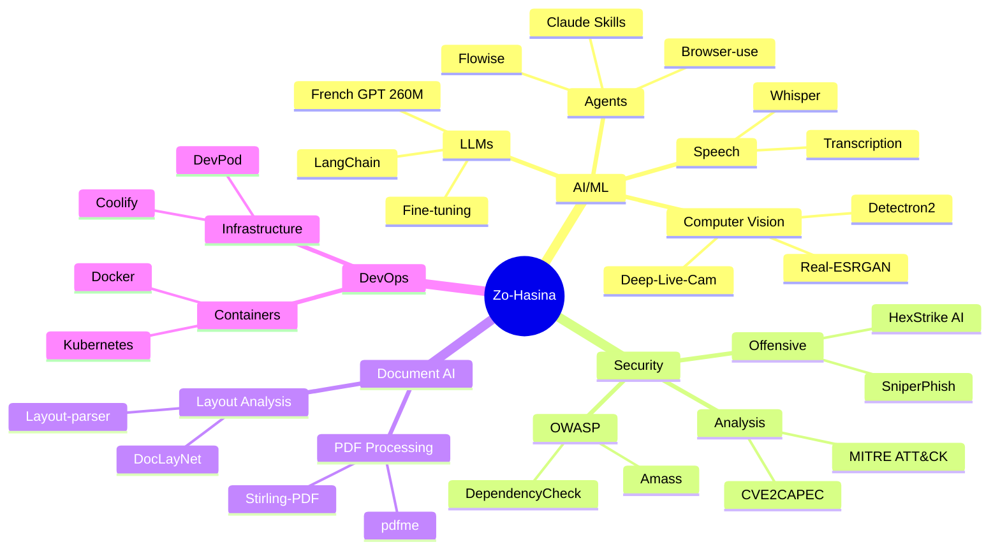

<!-- 
╔══════════════════════════════════════════════════════════════════════════════╗
║                                                                              ║
║   ███████╗ ██████╗       ██╗  ██╗ █████╗ ███████╗██╗███╗   ██╗ █████╗       ║
║   ╚══███╔╝██╔═══██╗      ██║  ██║██╔══██╗██╔════╝██║████╗  ██║██╔══██╗      ║
║     ███╔╝ ██║   ██║█████╗███████║███████║███████╗██║██╔██╗ ██║███████║      ║
║    ███╔╝  ██║   ██║╚════╝██╔══██║██╔══██║╚════██║██║██║╚██╗██║██╔══██║      ║
║   ███████╗╚██████╔╝      ██║  ██║██║  ██║███████║██║██║ ╚████║██║  ██║      ║
║   ╚══════╝ ╚═════╝       ╚═╝  ╚═╝╚═╝  ╚═╝╚══════╝╚═╝╚═╝  ╚═══╝╚═╝  ╚═╝      ║
║                                                                              ║
║                    R A S A T A V O H A R Y                                   ║
║                                                                              ║
╚══════════════════════════════════════════════════════════════════════════════╝
-->

<div align="center">
  
<!-- Animated Header -->


<!-- Typing Animation -->
<a href="https://git.io/typing-svg">
  
</a>

<!-- Profile Stats Badges -->
<p align="center">
  
  
  
</p>

<!-- Social Badges -->
<p align="center">
  <a href="https://www.zonova.io">
    
  </a>
  <a href="https://resumify.app">
    
  </a>
  <a href="https://www.aquantic.io">
    
  </a>
  <a href="https://www.time-flow.eu">
    
  </a>
</p>

<!-- Counter Badges -->
<p align="center">
  
  
  
  
</p>

</div>

---

## 🧬 About Me


```typescript
const zoHasina: TechFounder = {
  location: "🇫🇷 France",
  company: "Zonova SARL",
  role: "Founder & CEO",
  githubSince: "June 2009", // User #93783
  
  currentFocus: [
    "🤖 AI Agents & LLM Fine-tuning",
    "🔐 Cybersecurity Tools",
    "📄 Document AI & Processing",
    "🚀 Startup Products"
  ],
  
  expertise: {
    ai_ml: "LLMs, Computer Vision, Speech Recognition",
    security: "OWASP, Pentesting, Attack Surface Analysis",
    fullstack: "Node.js, TypeScript, Vue, React",
    devops: "Kubernetes, Docker, Cloud Architecture",
    hardware: "Arduino, NFC, IoT"
  },
  
  languages: [
    "JavaScript", "TypeScript", "Python", "Vue",
    "HTML/CSS", "Java", "C#", "Ruby", "Delphi"
  ],
  
  philosophy: `The less digitalized companies are 
    the ones which outcomes the most valuable 
    part of the market, when they follow the 
    path of Digitalisation and Innovation`
};
```

<br clear="both"/>

---

## 🏢 My Ventures

<div align="center">

<table>
<tr>
<td align="center" width="50%">

### 🌐 Zonova
**Innovation & Digitalisation**


Multi-technology mobile, web, desktop apps development. Project management, IT production, testing & validation.

[](https://www.zonova.io)
[](https://github.com/FR-Zonova)

</td>
<td align="center" width="50%">

### 📄 Resumify
**Show. Don't Tell.**


Smart portfolio platform with AI-powered resume generation. Partners: UTBM, Eucléa, ESTA Belfort.

[](https://resumify.app)
[](https://github.com/ResumifyApp)

</td>
</tr>
<tr>
<td align="center" width="50%">

### 💧 Aquantic
**Smart Work, Successful People**


Digital innovation, training (Docker, Kubernetes), personality testing for HR, management consulting.

[](https://www.aquantic.io)
[](https://github.com/AquanticTech)

</td>
<td align="center" width="50%">

### ⏱️ Time-Flow
**Master Your Time**


Time management and productivity solutions for modern teams and professionals.

[](https://www.time-flow.eu)

</td>
</tr>
</table>

</div>

---

## 🎯 Domain Expertise

<div align="center">

| Domain | Expertise | Key Projects |
|:------:|:----------|:-------------|
| 🤖 **AI & ML** | LLMs from scratch, Fine-tuning, Computer Vision, Speech Recognition, AI Agents | `LLMs-from-scratch`, `french-llm-from-scratch`, `detectron2`, `whisper`, `Flowise` |
| 🔐 **Cybersecurity** | OWASP Tools, Pentesting, CVE/MITRE Mapping, Attack Surface Analysis | `amass`, `hexstrike-ai`, `DependencyCheck`, `SniperPhish`, `CVE2CAPEC` |
| 📄 **Document AI** | PDF Analysis, Layout Detection, OCR Pipelines | `pdf-document-layout-analysis`, `layout-parser`, `DocLayNet`, `Stirling-PDF` |
| 🌐 **Full-Stack** | Node.js, TypeScript, Vue, React, Chrome Extensions | `Iphone-Powered`, `http-server-basicauth-ssl`, `LibreChat` |
| ☸️ **DevOps** | Kubernetes, Docker, Cloud Deployment, Dev Environments | `kubespray`, `devpod`, `coolify-cli`, `rudder` |
| 🔌 **Hardware/IoT** | Arduino, NFC, Smart Cards, Embedded Systems | `AFE4490_Oximeter`, `android-hce`, `cardpeek-emv` |

</div>

---

## 🛠️ Tech Arsenal

<div align="center">

### 💻 Languages
<p>
  
</p>

### 🤖 AI & Machine Learning
<p>
  
  
  
  
  
</p>

### 🔐 Security & OSINT
<p>
  
  
  
  
</p>

### ☁️ DevOps & Cloud
<p>
  
</p>

### 🗄️ Databases & Backend
<p>
  
</p>

### 🔧 Tools & Platforms
<p>
  
</p>

</div>

---

## 📊 GitHub Analytics

<div align="center">
  


</div>

<!-- Activity Graph -->
<div align="center">
  
</div>

<!-- 2025 Stats Card -->
<div align="center">
  
### 📈 2025 Activity
  
| Metric | Count |
|:------:|:-----:|
| 🔥 Total Contributions | **739** |
| 📝 Commits | **233** |
| 🔀 Pull Requests | **7** |
| 📦 Repository Contributions | **54** |

</div>

---

## 🏆 Achievements

<div align="center">
  
</div>

---

## 🌟 Featured Projects

<div align="center">

<a href="https://github.com/rasata/Iphone-Powered">
  
</a>
<a href="https://github.com/rasata/http-server-basicauth-ssl">
  
</a>

</div>

### 🔬 Recent Original Projects

| Project | Description | Tech |
|:--------|:------------|:----:|
| 🎙️ [transcription-mp3-to-text](https://github.com/rasata/transcription-mp3-to-text) | Transcribe long mp3 files (12+ hours) using local AI | `Python` |
| 📄 [PDFDocToJson](https://github.com/rasata/PDFDocToJson) | PDF Document to JSON converter | `Document AI` |
| 🎄 [greeting-wall](https://github.com/rasata/greeting-wall) | Self-hosted service for end-of-year greetings | `TypeScript` |
| 🔧 [solve-issue-killer-network-service](https://github.com/rasata/solve-issue-killer-network-service) | Fix Killer Network Services issues on MSI laptops | `Utility` |
| 🎓 [formation-bigquery](https://github.com/rasata/formation-bigquery) | BigQuery training materials | `Data Engineering` |

---

## 🔭 Currently Exploring

<div align="center">

Based on my recent activity and starred projects:

| Interest | Projects | Why |
|:---------|:---------|:----|
| 🤖 **AI Assistants** | `openclaw/openclaw` ⭐118k | Personal AI that truly understands context |
| 👁️ **Computer Vision** | `detectron2` ⭐34k | Object detection & segmentation at scale |
| 🐚 **AI Shell Tools** | `ShellOracle` | Intelligent command generation |
| 🎭 **Claude Skills** | `awesome-claude-skills` ⭐28k | Extending AI capabilities |
| 📡 **WebRTC** | `coturn` ⭐13k | Real-time communication infrastructure |

</div>

---

## 🧠 AI & Security Stack

<div align="center">



</div>

---

## 🐍 Contribution Snake

<div align="center">
  
<picture>
  <source media="(prefers-color-scheme: dark)" srcset="https://raw.githubusercontent.com/rasata/rasata/output/github-snake-dark.svg" />
  <source media="(prefers-color-scheme: light)" srcset="https://raw.githubusercontent.com/rasata/rasata/output/github-snake.svg" />
  
</picture>

</div>

> 💡 *Si le snake ne s'affiche pas, exécutez le workflow "Generate Snake Animation" dans l'onglet Actions*

---

## 💡 Philosophy

<div align="center">

```
╔═══════════════════════════════════════════════════════════════════════════════╗
║                                                                               ║
║   "The less digitalized companies are the ones which outcomes the most        ║
║    valuable part of the market, when they follow the path of                  ║
║    Digitalisation and Innovation"                                             ║
║                                                                               ║
║                                              — Zo-Hasina Rasatavohary         ║
║                                                                               ║
╚═══════════════════════════════════════════════════════════════════════════════╝
```

</div>

---

## 🤝 Let's Connect & Collaborate

<div align="center">

<p>
  <a href="https://www.linkedin.com/company/zonova">
    
  </a>
  <a href="mailto:contact@zonova.io">
    
  </a>
  <a href="https://github.com/rasata">
    
  </a>
  <a href="https://gist.github.com/rasata">
    
  </a>
</p>

### 💼 Open for

<p>
  
  
  
  
</p>


</div>

---

## 📅 GitHub Journey Timeline

<div align="center">

```
2009 ─────────────────────────────────────────────────────────────────── 2025
  │                                                                        │
  ├─ 🎂 Joined GitHub (June 9, 2009)                                       │
  │   User #93783 - Early Adopter                                          │
  │                                                                        │
  ├─ 📱 Iphone-Powered (2014)                                              │
  │   First popular project - 50+ ⭐                                       │
  │                                                                        │
  ├─ 🏢 Founded Zonova                                                     │
  │   Innovation & Digitalisation                                          │
  │                                                                        │
  ├─ 💧 Launched Aquantic                                                  │
  │   Training & Consulting                                                │
  │                                                                        │
  ├─ 📄 Building Resumify (2024-Now)                                       │
  │   AI-powered portfolio platform                                        │
  │                                                                        │
  └─ 🚀 2025: 739 contributions & counting!                                │
      233 commits | 7 PRs | 54 repo contributions                          │
```

</div>

---

<!-- Footer -->
<div align="center">
  


<p>
  
  
  
  
</p>

**✨ "Innovation distinguishes between a leader and a follower" — Steve Jobs ✨**

<sub>⭐ Star my repos if you find them useful! | 🤝 Let's build something amazing together | 💼 Open for opportunities</sub>

---


**@rasata** · Serial Entrepreneur · AI & Security Expert · 16+ Years on GitHub

</div>
